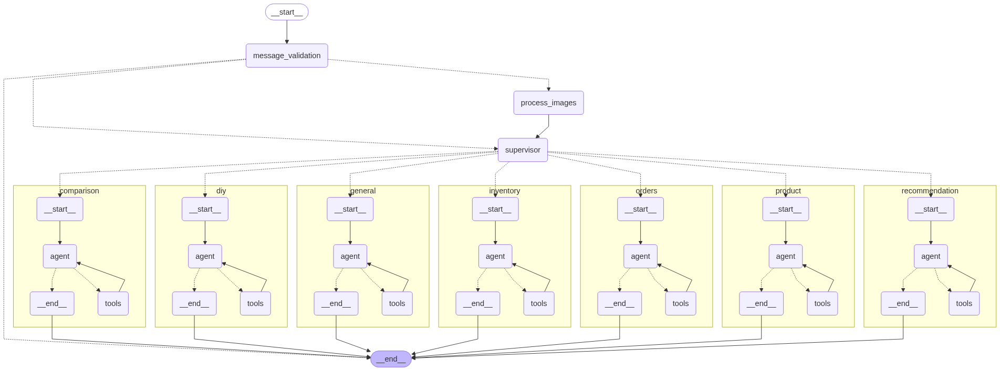

# Retail AI Agent

A conversational AI system for retail operations built on Databricks, providing recommendation, inventory management, and product information capabilities through a unified agent architecture.

## Overview

This project implements a LangGraph-based conversational AI agent for retail operations that can:

- Answer questions about product inventory
- Provide product recommendations based on customer preferences
- Look up specific product details using SKU/UPC codes
- Compare products across features and specifications
- Answer general retail-related questions
- Provide DIY project guidance and tutorials

The system uses Databricks Vector Search, Unity Catalog, Genie, and LLMs to provide accurate, context-aware responses.

## Architecture

### Overview

The Retail AI system is built as a sophisticated agent-based architecture that routes queries to specialized agents based on the nature of the request. This approach enables domain-specific handling while maintaining a unified interface.

### Core Components

#### Message Routing and Processing

- **Message Validation**: Validates incoming requests against required configuration parameters
- **Router Agent**: Analyzes user queries and routes them to the appropriate specialized agent
- **Factuality Check**: Ensures responses are factually accurate through iterative refinement

#### Specialized Agents

1. **General Agent**: Handles general inquiries about store policies and basic information
2. **Product Agent**: Provides detailed product specifications, availability, and compatibility
3. **Inventory Agent**: Offers real-time inventory checks and stock availability across locations
4. **Recommendation Agent**: Suggests products based on user preferences and purchase history
5. **Orders Agent**: Manages order status inquiries, tracking, and order history
6. **Comparison Agent**: Compares different products to help customers make informed decisions
7. **DIY Agent**: Offers project advice, tutorials, and step-by-step instructions for DIY projects

### Guardrails and Quality Control

- **Factuality Judge**: Evaluates responses for factual accuracy and triggers refinement when needed
- **Configuration Validation**: Ensures all required parameters are provided before processing
- **Retry Mechanism**: Implements intelligent retry logic when responses don't meet quality thresholds

### Technical Implementation

The system is implemented using:

- **LangGraph**: For workflow orchestration and state management
- **LangChain**: For LLM interactions and chain composition
- **MLflow**: For model deployment and serving
- **Databricks LLM APIs**: As the foundation models for natural language processing

The architecture follows a graph-based state machine pattern:

1. User messages enter through validation
2. Messages are routed by the router agent
3. Specialized agents process domain-specific requests
4. Responses undergo factuality checking
5. If needed, responses are refined until they meet quality thresholds



## Development Workflow

### Project Structure

```
retail_ai/
├── agents.py          # Agent implementations
├── catalog.py         # Unity Catalog integration
├── graph.py           # LangGraph workflow definition
├── models.py          # MLflow model integration
├── nodes.py           # Agent node definitions
├── tools.py           # Tool definitions
└── vector_search.py   # Vector search utilities

notebooks/
├── 05_agent_as_code_driver.py    # Model logging & registration
├── 06_evaluate_agent.py          # Model evaluation
└── 07_deploy_agent.py            # Model deployment & permissions
```

### Notebook Workflow

The development workflow is organized into focused notebooks:

1. **`05_agent_as_code_driver.py`**: Model development, logging, and registration
2. **`06_evaluate_agent.py`**: Formal MLflow evaluation and performance metrics
3. **`07_deploy_agent.py`**: Model alias management, endpoint deployment, and permissions

## Contributing

For detailed information about the tools architecture, development patterns, and how to contribute new tools, see [CONTRIBUTING.md](CONTRIBUTING.md).

### Quick Start for Contributors

1. **Understand the Architecture**: Review the tools patterns in `CONTRIBUTING.md`
2. **Set up Development Environment**: Follow the setup instructions below
3. **Add New Tools**: Use the factory patterns and examples in the contributing guide
4. **Test Your Changes**: Use the evaluation notebook for integration testing
5. **Submit Pull Request**: Follow the code review checklist

## Prerequisites

- Python 3.12+
- Databricks workspace with access to:
  - Unity Catalog
  - Model Serving
  - Vector Search
  - Genie
- Databricks model endpoints:
  - LLM endpoint (default: databricks-meta-llama-3-3-70b-instruct)
  - Embedding model endpoint (default: databricks-gte-large-en)

## Setup

1. Clone this repository
2. Install dependencies:

```bash
# Create and activate a Python virtual environment 
uv venv
source .venv/bin/activate  # On Windows: .venv\Scripts\activate

# Install dependencies
uv sync
```

3. Configure your environment:
   - Copy `model_config.yaml.template` to `model_config.yaml`
   - Update configuration with your Databricks workspace details

## Configuration

Configuration is managed through `model_config.yaml`, which includes:

- Catalog and database information
- LLM model endpoints
- Vector search settings
- Genie space ID
- Application deployment details

## Usage

### Development

Run the notebooks in order:

1. **Data Setup**: `01_ingest-and-transform.py`, `02_provision-vector-search.py`
2. **Model Development**: `05_agent_as_code_driver.py`
3. **Evaluation**: `06_evaluate_agent.py`
4. **Deployment**: `07_deploy_agent.py`

### Production

Once deployed, the agent can be called with:

```python
from mlflow.deployments import get_deploy_client

client = get_deploy_client("databricks")
response = client.predict(
  endpoint="retail_ai_agent",
  inputs={
    "messages": [
      {"role": "user", "content": "Can you recommend a lamp to match my oak side tables?"}
    ],
    "custom_inputs": {
      "configurable": {
        "thread_id": "1",
        "tone": "friendly"
      }
    }
  }
)
```

## Troubleshooting

### Common Issues

1. **Tool Not Found**: Ensure tool is registered in the agent configuration
2. **Type Errors**: Check Pydantic model definitions and field types
3. **Database Errors**: Verify Unity Catalog permissions and function names
4. **Vector Search Issues**: Check endpoint status and index configuration

### Debugging

Enable debug logging:

```python
import logging
logging.getLogger("retail_ai").setLevel(logging.DEBUG)
```

Use MLflow tracing to debug tool execution:

```python
# View traces in MLflow UI
mlflow.set_tracking_uri("databricks")
```

## License

This project is licensed under the MIT License - see the [LICENSE](LICENSE) file for details.


