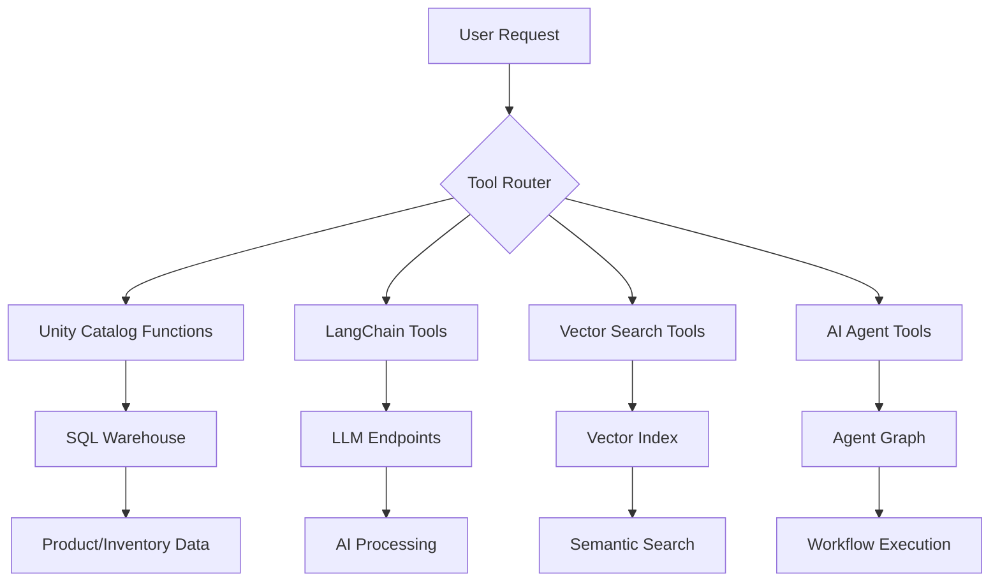

# Tools Overview

The Retail AI system provides a comprehensive set of tools for retail operations. These tools are organized into several categories based on their functionality and implementation.

## Tool Categories

### 🗄️ Unity Catalog Functions
SQL functions that provide direct database access for product and inventory operations.

- **Product Lookup**: Find products by SKU or UPC
- **Inventory Management**: Check stock levels across stores
- **Store Operations**: Location-specific inventory queries

[Learn more about Unity Catalog Functions →](unity-catalog-functions.md)

### 🔗 LangChain Tools
Python-based tools that provide AI-powered functionality using the LangChain framework.

- **Product Analysis**: Compare products, extract features
- **Search & Discovery**: Semantic search, classification
- **Data Processing**: SKU extraction, validation

[Learn more about LangChain Tools →](langchain-tools.md)

### 🔍 Vector Search Tools
Semantic search capabilities using vector embeddings for intelligent product discovery.

- **Product Description Search**: Find products using natural language
- **Similarity Matching**: Recommend similar products
- **Content Retrieval**: Extract relevant product information

[Learn more about Vector Search →](vector-search.md)

### 🤖 AI Agent Tools
Multi-agent system components for orchestrating complex retail workflows.

- **State Management**: Conversation context and history
- **Workflow Orchestration**: Multi-step processes
- **Guardrails**: Content safety and quality control

[Learn more about AI Agents →](ai-agents.md)

## Quick Reference

### Most Common Tools

| Tool | Purpose | Input | Output |
|------|---------|-------|--------|
| `find_product_by_sku` | Product lookup | SKU list | Product details |
| `find_inventory_by_sku` | Inventory check | SKU list | Stock levels |
| `product_comparison` | Compare products | Product list | Comparison analysis |
| `vector_search` | Semantic search | Description text | Matching products |

### Tool Selection Guide

**For Product Information:**
- Use `find_product_by_sku` for exact SKU lookups
- Use `vector_search` for description-based discovery
- Use `product_comparison` for detailed analysis

**For Inventory Management:**
- Use `find_inventory_by_sku` for general stock levels
- Use `find_store_inventory_by_sku` for store-specific queries
- Use direct SQL tools for real-time data

**For Customer Interactions:**
- Use AI agent tools for conversational interfaces
- Use vector search for product recommendations
- Use comparison tools for decision support

## Tool Architecture



## Integration Patterns

### Tool Chaining
Tools can be chained together for complex workflows:

```python
# Example: Product recommendation workflow
sku_list = sku_extraction_tool(user_input)
products = find_product_by_sku_tool(sku_list)
similar_products = vector_search_tool(products[0].description)
comparison = product_comparison_tool([products[0]] + similar_products)
```

### Conditional Execution
Tools can be selected based on context:

```python
if user_has_sku:
    result = find_product_by_sku_tool(sku)
elif user_has_description:
    result = vector_search_tool(description)
else:
    result = genie_tool(user_query)
```

### Error Handling
Robust error handling across tool types:

```python
try:
    result = primary_tool(input)
except ToolError:
    result = fallback_tool(input)
```

## Performance Considerations

### Tool Selection
- **Unity Catalog Functions**: Fastest for exact matches
- **Vector Search**: Best for semantic similarity
- **LLM Tools**: Most flexible but slower
- **Agent Tools**: Most comprehensive but highest latency

### Optimization Tips
1. **Cache Results**: Store frequently accessed data
2. **Batch Operations**: Group similar requests
3. **Parallel Execution**: Run independent tools concurrently
4. **Smart Routing**: Choose optimal tool for each request

## Development Guidelines

### Adding New Tools

1. **Define the Tool Interface**
   ```python
   @tool
   def my_new_tool(input: str) -> str:
       """Tool description for the LLM."""
       # Implementation
       return result
   ```

2. **Add Configuration**
   ```yaml
   # model_config.yaml
   functions:
     my_new_tool:
       name: catalog.database.my_function
   ```

3. **Create Tests**
   ```python
   def test_my_new_tool():
       result = my_new_tool("test_input")
       assert result is not None
   ```

4. **Update Documentation**
   - Add to appropriate tool category
   - Include usage examples
   - Document parameters and outputs

### Best Practices

- **Single Responsibility**: Each tool should have one clear purpose
- **Type Hints**: Use proper type annotations
- **Error Handling**: Implement robust error handling
- **Documentation**: Include clear docstrings and examples
- **Testing**: Write comprehensive tests
- **Performance**: Consider caching and optimization

## Monitoring and Debugging

### Tool Execution Tracking
```python
import mlflow

@mlflow.trace(span_type="TOOL", name="my_tool")
def my_tool(input):
    # Tool implementation
    pass
```

### Logging
```python
from loguru import logger

def my_tool(input):
    logger.info(f"Executing tool with input: {input}")
    # Implementation
    logger.info(f"Tool completed successfully")
```

### Performance Metrics
- Execution time
- Success/failure rates
- Resource usage
- User satisfaction

## Next Steps

- [Unity Catalog Functions](unity-catalog-functions.md) - Database integration tools
- [LangChain Tools](langchain-tools.md) - AI-powered processing tools
- [Vector Search](vector-search.md) - Semantic search capabilities
- [AI Agents](ai-agents.md) - Multi-agent orchestration
- [Developer Guide](../development/adding-tools.md) - Create custom tools 