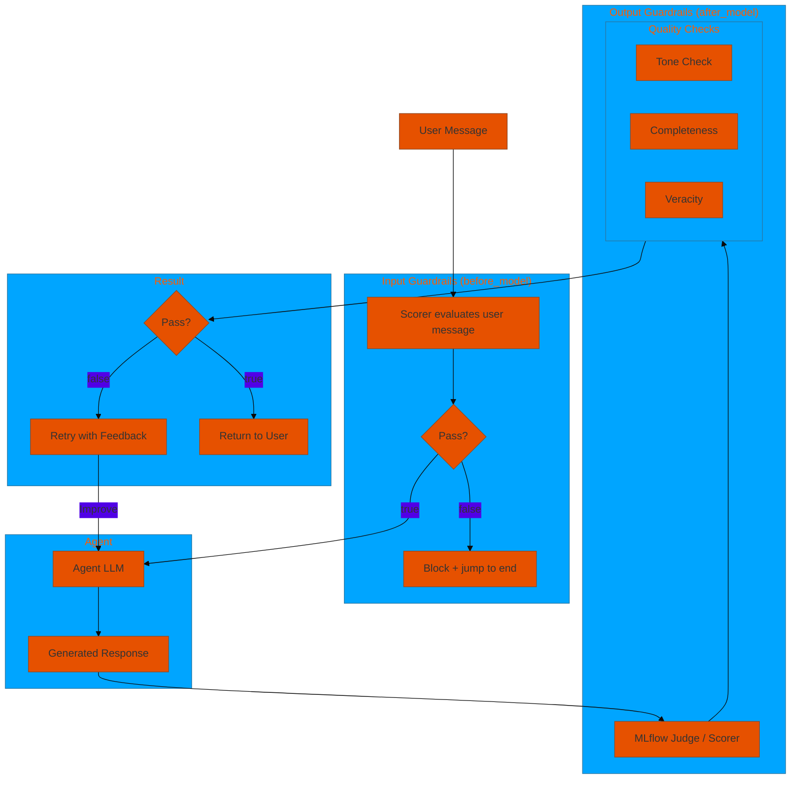
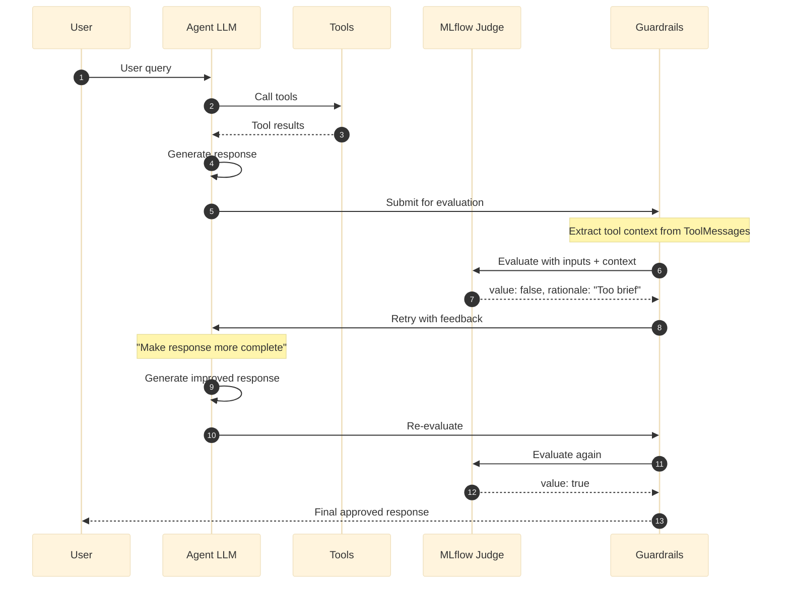

# 08. Guardrails

**MLflow judge-based quality control for agent responses**

Use MLflow judges (`mlflow.genai.judges.make_judge`) to evaluate response quality and automatically retry with feedback when standards aren't met. The **prompt determines the evaluation type** -- tone, completeness, veracity/groundedness, or any custom criteria.

Tool context from `ToolMessage` objects in the conversation (search results, SQL results, Genie responses) is automatically extracted and included in `{{ inputs }}`, enabling veracity checks.

## Architecture Overview



## Examples

| File | Description |
|------|-------------|
| [`guardrails_basic.yaml`](./guardrails_basic.yaml) | MLflow judge-based guardrails with tone, completeness, and veracity checks |
| [`guardrails_scorers.yaml`](./guardrails_scorers.yaml) | MLflow Scorer-based guardrails (ToxicLanguage, GibberishText) alongside custom judges |
| [`guardrails_ai_decide.yaml`](./guardrails_ai_decide.yaml) | Jev-style guardrails and evaluation backed by Databricks `ai_decide`: a custom yes/no guardrail plus the built-in guardrails |

## How Guardrails Work



## Configuration

### 1. Define Guardrail Prompts

Prompts use Jinja2 template variables:
- `{{ inputs }}` -- Contains the user query AND extracted tool context
- `{{ outputs }}` -- Contains the agent's response

```yaml
prompts:
  professional_tone_prompt: &professional_tone_prompt
    schema: *retail_schema
    name: professional_tone_guardrail
    template: |
      Evaluate if the response is professional and appropriate.
      
      User Request: {{ inputs }}
      Agent Response: {{ outputs }}
      
      The response should:
      - Use professional language (no slang)
      - Be respectful and courteous
      - Be clear and easy to understand
      
      Rate as true if criteria met, false if not.

  # Veracity prompt -- leverages tool context in {{ inputs }}
  veracity_guardrail_prompt: &veracity_guardrail_prompt
    schema: *retail_schema
    name: veracity_guardrail
    template: |
      Evaluate whether the response is grounded in the retrieved context.

      User query and retrieved context: {{ inputs }}
      Agent response: {{ outputs }}

      Rate as true if all claims are grounded, false if any are fabricated.
```

### 2. Define Guardrails

```yaml
guardrails:
  tone_guardrail: &tone_guardrail
    name: tone_check
    model: *judge_llm             # Separate LLM for evaluation
    prompt: *professional_tone_prompt
    num_retries: 2                # Max retries before giving up
  
  completeness_guardrail: &completeness_guardrail
    name: completeness_check
    model: *judge_llm
    prompt: *completeness_guardrail_prompt
    num_retries: 2

  veracity_guardrail: &veracity_guardrail
    name: veracity_check
    model: *judge_llm
    prompt: *veracity_guardrail_prompt
    num_retries: 2
    fail_on_error: false           # Let responses through on evaluation error
```

### 3. Apply to Agents

```yaml
agents:
  general_agent: &general_agent
    name: assistant
    model: *default_llm
    tools:
      - *search_tool
    
    # Apply guardrails to this agent
    guardrails:
      - *tone_guardrail
      - *completeness_guardrail
      - *veracity_guardrail
```

## Input vs Output Guardrails

By default guardrails run on both user input and model output (`apply_to: both`).
Use `apply_to` to control when each guardrail executes:

| Value | Hook | Behaviour |
|-------|------|-----------|
| `input` | `before_model` | Evaluates the user message **before** the model runs. On failure the request is immediately blocked (no retries). |
| `output` | `after_model` | Evaluates the model's response **after** it runs. On failure the model retries up to `num_retries` times. |
| `both` | both hooks | Runs the guardrail in both places. |

```yaml
guardrails:
  pii_guardrail:
    name: pii_check
    scorer: my_package.scorers.DetectPII
    apply_to: input        # block PII in user messages before the model runs

  tone_guardrail:
    name: tone_check
    model: *judge_llm
    prompt: *tone_prompt
    apply_to: output       # evaluate agent response quality only
```

## Specialized Guardrails (Zero-Config)

Specialized guardrails provide built-in expert prompts -- no prompt authoring needed. Configure via the `middleware:` section.

### Veracity Guardrail

Checks if the response is grounded in tool/retrieval context. **Automatically skips** when no tool context is present.

```yaml
middleware:
  veracity_check:
    name: dao_ai.middleware.create_veracity_guardrail_middleware
    args:
      model: "databricks:/databricks-claude-3-7-sonnet"
      num_retries: 2
```

### Relevance Guardrail

Ensures the response directly addresses the user's query. Detects topic drift.

```yaml
middleware:
  relevance_check:
    name: dao_ai.middleware.create_relevance_guardrail_middleware
    args:
      model: "databricks:/databricks-claude-3-7-sonnet"
```

### Tone Guardrail

Validates response tone against a preset profile. Profiles: `professional`, `casual`, `technical`, `empathetic`, `concise`.

```yaml
middleware:
  tone_check:
    name: dao_ai.middleware.create_tone_guardrail_middleware
    args:
      model: "databricks:/databricks-claude-3-7-sonnet"
      tone: professional   # or: casual, technical, empathetic, concise
```

### Conciseness Guardrail

Hybrid deterministic length check + LLM verbosity evaluation. The length check runs first with zero LLM cost.

```yaml
middleware:
  conciseness_check:
    name: dao_ai.middleware.create_conciseness_guardrail_middleware
    args:
      model: "databricks:/databricks-claude-3-7-sonnet"
      max_length: 2000
      min_length: 50
      check_verbosity: true
```

## ai_decide Guardrails (Jev-Style Decisions)

MLflow 3.17 added "Jev decision" judges: structured yes/no and categorical verdicts with calibrated probabilities instead of a free-text critique. MLflow reaches them only through the external TypeSafe API or the OSS MLflow gateway. Databricks serves the same decision model on-platform as the [`ai_decide`](https://docs.databricks.com/aws/en/large-language-models/ai-functions) AI function (Beta), and DAO AI can use it as an **opt-in** judge for guardrails and evaluation.

**Choosing the judge.** The LLM judge is the default, because it explains each failure and that critique is what the model gets on a retry. ai_decide is opt-in. The same rule applies to `guardrails:` entries, the built-in guardrail middlewares, and `evaluation:`:

| You write | Judge |
|---|---|
| `model:` (or `safety_model:` / `scorer:`) | that LLM judge or scorer (written critique) |
| `ai_decide: true` | ai_decide with default settings (`threshold: 0.5`) |
| `ai_decide: {threshold: 0.8}` | ai_decide with those settings |
| neither | error for guardrails (a judge is required); MLflow LLM judges for `evaluation:` |

Setting both `model:` and `ai_decide: true` (or settings) is an error. In production monitoring, ai_decide scorers can't be registered, so they're skipped with a warning.

An ai_decide guardrail asks **one yes/no question**. By default a "yes" passes; with `pass_if: "no"` the question asks whether a violation is present and a "no" passes. The guardrail passes when the pass probability is at or above `threshold`:

```yaml
guardrails:
  no_competitors: &no_competitors
    name: no_competitor_mentions
    prompt: >-
      Does {{ outputs }} name a store or retailer other than Brickhouse
      Hardware? Product brands like DeWalt or Ryobi are not stores.
    pass_if: "no"            # the question detects a violation
    ai_decide:               # or `ai_decide: true` for the default threshold (0.5)
      threshold: 0.7         # pass probability needed to pass
    criteria:
      pass_when: The response does not name any competing retailer.
      fail_when: >-
        The response names a competing retailer. Rewrite it without naming
        any other retailer.
    num_retries: 2
```

**Writing good ai_decide questions.** Measured live against known-good and known-bad responses:

- ai_decide reliably *detects that something is present* and is unreliable at *confirming that something is absent*. "Does the response name a competitor?" (`pass_if: "no"`) was correct every time. "Is the response free of competitor names?" scored clean responses as failing. Prefer violation questions with `pass_if: "no"` for "must not contain X" checks.
- Disambiguate borderline terms in the question itself, e.g. "product brands like DeWalt are not stores".
- Verbosity is judged strictly: ordinary chat answers that close with offers of further help score as padded, about as low as deliberately padded text. Use `check_verbosity: false` (length check only) unless the agent is meant to be terse.
- Answers on ambiguous cases can flip between runs (e.g. 0.0 vs 0.95 on the same input), so test each question against a few known-good and known-bad responses before relying on it.
- DAO AI sends neutral question ids (`q1`, `q2`, ...) because ai_decide reads the id as part of the question: an id like `no_competitor_mentions` overrode instructions asking the opposite. Guardrail and metric names stay local.

The built-in guardrails accept `ai_decide:` in place of `model:` and switch to built-in yes/no questions tuned for ai_decide:

```yaml
middleware:
  relevance_middleware:
    name: dao_ai.middleware.create_relevance_guardrail_middleware
    args:
      ai_decide: true       # default settings
      num_retries: 2

  strict_tone_middleware:
    name: dao_ai.middleware.create_tone_guardrail_middleware
    args:
      tone: professional
      ai_decide:
        threshold: 0.8      # configure ai_decide
```

This covers `create_veracity_guardrail_middleware`, `create_relevance_guardrail_middleware`, `create_tone_guardrail_middleware` (presets and `custom_guidelines`), `create_conciseness_guardrail_middleware`, `create_safety_guardrail_middleware`, and the generic `create_guardrail_middleware`. Each needs exactly one judge: `model:` (`safety_model:` for safety) or `ai_decide:`.

> **Safety guardrail needs a judge.** `create_safety_guardrail_middleware` used to fall back to `openai:/gpt-4o-mini` when no `safety_model` was set. That needs OpenAI credentials; without them every check errored and, with the default `fail_on_error: false`, every response was let through. It now fails at config load unless `safety_model` or `ai_decide` is set.

| | LLM judge (`model:`, default) | ai_decide (`ai_decide:`, opt-in) |
|---|---|---|
| Question | Long rubric prompt | One yes/no question (true = pass) |
| Result | Pass/fail + written rationale | Probability (+ `threshold`, `pass_if`) |
| Retry feedback | The judge's rationale | `criteria.fail_when` (or the question), plus the probability |
| Latency per check | Seconds (LLM call) | ~0.2–1 s |

**How it is called.** Each check is `POST /api/2.0/ai-functions/ai-decide` through the Databricks SDK, as the agent's runtime identity (verified on Databricks Apps and on Model Serving with and without an explicit `service_principal`). No warehouse is needed.

**What the judge sees.** ai_decide reads a JSON `state` of `{"inputs": {"query", "context"}, "outputs": {"response"}}`. `{{ inputs }}` / `{{ outputs }}` in the prompt are rewritten to `state.inputs` / `state.outputs`.

## Retry Behavior

When an output guardrail fails, its feedback is added as a message and the model is **re-run** on it. The retry budget is per user turn:

- Each guardrail retries at most `num_retries - 1` times per turn. Passing doesn't refund the budget, so guardrails with conflicting criteria can't keep re-triggering each other.
- A guardrail that runs out of retries ends the turn with a "Quality Check Failed" notice. Later output guardrails don't judge that notice; `after_agent` checks such as the safety guardrail still run.
- Guardrails always judge the user's original question, not the retry feedback.
- The next user turn starts with a fresh budget.

Every retry is another model call (plus a judge call for each guardrail), so keep `num_retries` small and avoid stacking guardrails whose criteria can conflict.

## Scorer-Based Guardrails (MLflow Scorers)

Scorer-based guardrails use MLflow's `Scorer` interface to plug in any evaluation logic. Any class extending `mlflow.genai.scorers.base.Scorer` can be referenced by fully-qualified name; install whatever runtime dependencies that scorer requires before deploying.

### Configuration via `guardrails:` Section

```yaml
guardrails:
  pii_guardrail: &pii_guardrail
    name: pii_check
    scorer: my_package.scorers.DetectPII
    scorer_args:
      pii_entities: ["CREDIT_CARD", "SSN", "EMAIL_ADDRESS"]
    fail_on_error: true
```

### Configuration via `middleware:` Section

```yaml
middleware:
  custom_check:
    name: dao_ai.middleware.create_scorer_guardrail_middleware
    args:
      name: custom_check
      scorer_name: my_package.scorers.MyCustomScorer
      fail_on_error: true
```

## Guardrail Types Summary

| Type | Config | Prompt Required | Key Feature |
|------|--------|----------------|-------------|
| **Custom Judge** | `guardrails:` with `model`+`prompt` | Yes | Fully customizable LLM evaluation |
| **Scorer-based** | `guardrails:` with `scorer` | No | MLflow Scorer interface (any class extending `Scorer`) |
| **ai_decide** | `guardrails:` with `ai_decide`+`prompt` | Yes (a yes/no question) | Calibrated probability + `threshold`, sub-second over REST; no written critique |
| **Veracity** | `middleware:` section | No | Auto-skips when no tool context |
| **Relevance** | `middleware:` section | No | Topic drift detection |
| **Tone** | `middleware:` section | No | Preset profiles (professional, etc.) |
| **Conciseness** | `middleware:` section | No | Hybrid deterministic + LLM |
| **Content Filter** | `middleware:` section | No | Deterministic keyword blocking |
| **Safety** | `middleware:` section | No | Structured safe/unsafe output |

## Configuration Options

### Guardrails (`guardrails:` section)

| Field | Type | Default | Description |
|-------|------|---------|-------------|
| `name` | string | required | Guardrail identifier |
| `model` | string/LLMModel | -- | LLM for the MLflow judge (required for custom judge mode) |
| `prompt` | string/PromptModel | -- | Evaluation instructions with `{{ inputs }}`/`{{ outputs }}` (required for custom judge mode) |
| `scorer` | string | -- | FQN of an MLflow `Scorer` class (required for scorer mode) |
| `scorer_args` | dict | `{}` | Kwargs forwarded to the scorer constructor |
| `num_retries` | int | 3 | Max retry attempts |
| `fail_on_error` | bool | false | Block responses when evaluation errors (e.g. scorer exception) |
| `max_context_length` | int | 8000 | Max chars for extracted tool context |
| `apply_to` | `"input"` / `"output"` / `"both"` | `"both"` | When to run: before the model (input), after the model (output), or both |

Either `model`+`prompt` (custom judge) or `scorer` (scorer-based) must be provided, not both.

### Specialized Guardrails (`middleware:` section)

| Guardrail | Required Args | Optional Args |
|-----------|---------------|---------------|
| **Veracity** | `model` | `num_retries` (2), `fail_on_error` (false), `max_context_length` (8000) |
| **Relevance** | `model` | `num_retries` (2), `fail_on_error` (false) |
| **Tone** | `model` | `tone` ("professional"), `custom_guidelines`, `num_retries` (2), `fail_on_error` (false) |
| **Conciseness** | `model` | `max_length` (3000), `min_length` (20), `check_verbosity` (true), `num_retries` (2), `fail_on_error` (false) |

## Model Configuration

```yaml
resources:
  models:
    default_llm: &default_llm
      name: databricks-claude-3-7-sonnet
      temperature: 0.7            # Higher for creative responses
      max_tokens: 4096

    judge_llm: &judge_llm
      name: databricks-claude-3-7-sonnet
      temperature: 0.3            # Lower for consistent evaluation
      max_tokens: 2048
```

## Quick Start

```bash
# Run with custom LLM-judge guardrails
dao-ai chat -c examples/08_guardrails/guardrails_basic.yaml

# See guardrail evaluation in logs
dao-ai chat -c examples/08_guardrails/guardrails_basic.yaml --log-level DEBUG
```

**Look for in logs:**
- `"Evaluating response with guardrail"` -- Starting evaluation
- `"Response approved by guardrail"` -- Passed
- `"Guardrail requested improvements"` -- Failed, retrying
- `"Guardrail failed - max retries reached"` -- Exhausted retries
- `"Guardrail failing open"` -- Judge error, letting through

## Best Practices

1. **Monitor trigger rates** -- Track how often each guardrail triggers retries
2. **Balance quality vs latency** -- Each retry adds a full model call
3. **Use lower temperature for judge** -- More consistent evaluations
4. **Test edge cases** -- Verify guardrails don't block valid responses
5. **Version prompts in MLflow** -- Track prompt changes over time
6. **Use fail_on_error: false** -- Prefer availability over strictness for most use cases
7. **Combine with offline evaluation** -- Use `create_veracity_scorer` for thorough trace-based evaluation

## Troubleshooting

| Issue | Solution |
|-------|----------|
| Too many retries | Improve agent prompt, reduce strictness |
| Guardrails never trigger | Check prompt scoring criteria |
| High latency | Reduce num_retries, use faster judge model |
| Inconsistent evaluation | Lower judge temperature |
| Judge errors | Check model endpoint availability, verify fail_on_error setting |

## Next Steps

- **11_prompt_engineering/** - Reuse guardrail prompts across agents
- **12_middleware/** - Combine with other middleware
- **99_complete_applications/** - See guardrails in production

## Related Documentation

- [Guardrails Configuration](../../../docs/key-capabilities.md#guardrails)
- [Prompt Engineering](../11_prompt_engineering/README.md)
